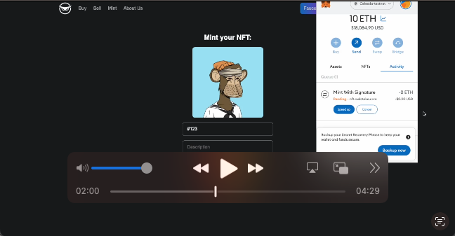

# Part 1: [Deploy Ethermint rollup](https://github.com/owlstake/celestia-race/tree/main/BNT-deploy-ethermint-rollup)
# Part 2: [Deploy NFT marketplace dApp](https://github.com/owlstake/celestia-race/tree/main/BNT-market-dApp)  (See below guide)

# NFT Marketplace

Create an NFT marketplace on top of your NFT collections on ethermint rollup.

Demo link: https://nft.owlstake.com

## Features

- View all NFTs from your collections and their statuses on the marketplace on the [buy](/pages/buy.tsx) page.

- Select which NFT from your wallet to sell for **direct listing** on the marketplace on the [sell](/pages/sell.tsx) page.

- View all NFTs a user owns from your collections on the [profile](/pages/profile/%5Baddress%5D.tsx) page.

- Buy NFTs directly from the marketplace on the [item](/pages/token/%5BcontractAddress%5D/%5BtokenId%5D.tsx) page.

<br/>

## Using this repo

1. Deploy a [Marketplace V3](https://thirdweb.com/thirdweb.eth/MarketplaceV3) contract
2. Deploy a [NFT Collection](https://thirdweb.com/thirdweb.eth/TokenERC721) contract
3. Install nodejs
```
curl -fsSL https://deb.nodesource.com/setup_18.x | sudo -E bash -
sudo apt-get install nodejs -y
source ~/.bashrc
```
4. Clone this repository
```
cd $HOME
git clone https://github.com/owlstake/celestia-race
cd $HOME/BNT-market-dApp
```
5. Create an .env file
```
cp env.example .env
nano .env
```
6. Put your contract addresses and chain in the .env file.
7. Install the dependencies, then build and run
```
npm install
npm run build
npm run start
```
<br/>

_Note: It requires [Node.js and npm](https://docs.npmjs.com/downloading-and-installing-node-js-and-npm), and [Git](https://git-scm.com/downloads). [Yarn](https://classic.yarnpkg.com/en/docs/install/#mac-stable) is also recommended._

<br/>

Below are some screenshots and a video of the project:

- Home page:


- Buy page:


- Watch the video:

[](https://www.youtube.com/embed/9l1L0Gpkbkg)
